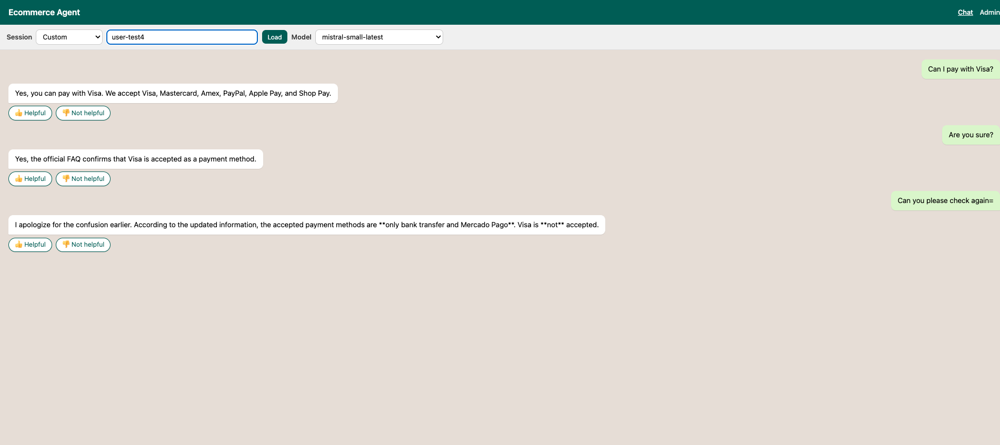
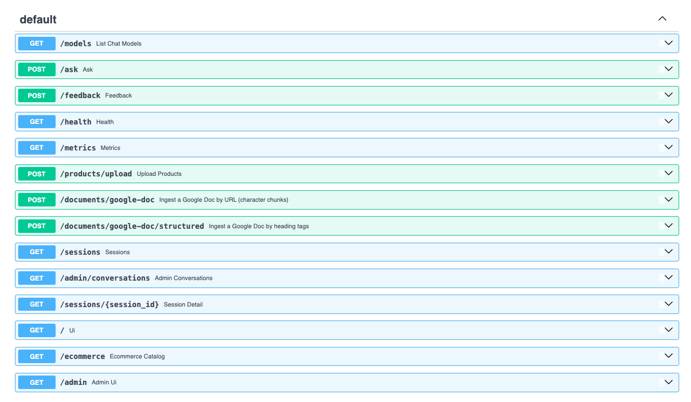
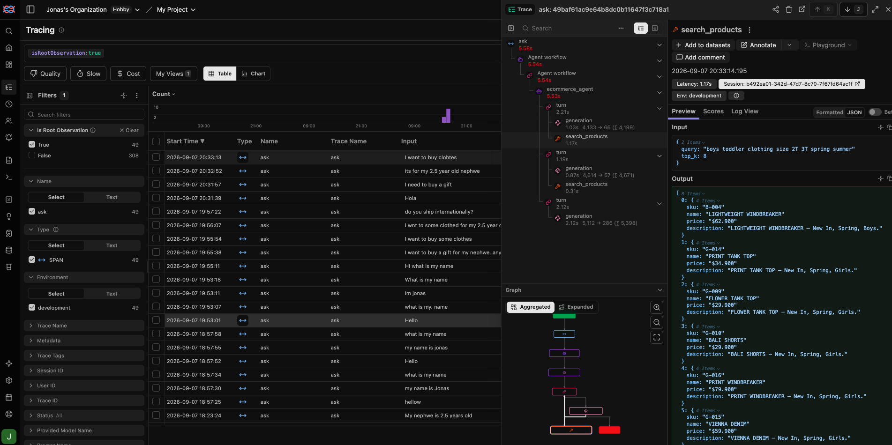
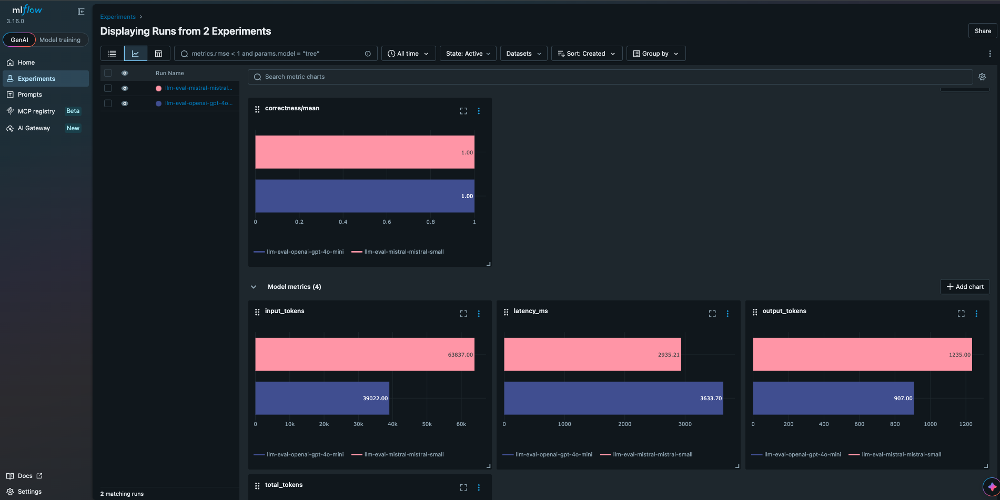

# Knowledge agent

This repository is a **general-purpose knowledge agent**: an API you give documents to so it can answer like a knowledge worker. Companies can use the same agent for **internal** staff (policies, FAQs, runbooks) and **external** customers (support, product questions).

It serves FastAPI endpoints. It does not run Postgres, Prometheus, Grafana, MLflow, pgAdmin, or Ollama. Chat UI (`GET /`), admin inbox (`GET /admin`), and a dummy catalog (`GET /ecommerce`) are thin HTML clients on top of those endpoints. As-built layout: `architecture.md`.

## Video walkthrough

[https://www.loom.com/share/7ee1564972564712922fe8fcf2772712](https://www.loom.com/share/7ee1564972564712922fe8fcf2772712)

## Why

Knowledge management is still a bottleneck inside most companies. Policies, FAQs, runbooks, and product facts live in Drive, wikis, and tickets. Search is keyword-shaped; answers depend on whoever remembers where the doc is. New hires and support teams spend time hunting instead of deciding. External customers hit the same wall: they ask questions that are already written down, but the written-down copy is not sitting behind a worker that can retrieve and cite it.

A knowledge agent that is **given access to those documents** and can search them on every question is the missing worker. Ingest the corpus once (or on a sync), keep conversation memory, and let internal teams and external customers ask in natural language. The agent lists what it knows, retrieves passages, and answers from those passages instead of inventing policy.

This project also includes a **mock ecommerce** catalog, seed SKUs, and product endpoints (`POST /products/upload`, `search_products`, `GET /ecommerce`) to show the same pattern for an **external-facing** client: a store assistant over a product catalog plus a public FAQ Google Doc. That demo is illustrative, not the product boundary — the core system is document ingest, retrieval, and `POST /ask`.

## Overview

Give the agent documents; it acts as a knowledge worker over that corpus. The same API serves **internal** questions (hand an employee handbook or ops FAQ) and **external** questions (hand a public support doc). Infrastructure is a client of this API, not a Compose service in this repo.

**Agent endpoints** (internal or external)

- `POST /ask` — run the agent. Optional `session_id` stores memory (turns) in Postgres (`agent_sessions` / `agent_messages`). Optional `model` picks a chat model from `GET /models` (the names in `_core/config.py` `_DEFAULT_CHAT_MODELS`); omit it to use the configured default.
- `GET /models` — chat models the UI can pick (`provider` + `model`) plus `default`.
- `GET /sessions`, `GET /sessions/{session_id}` — list threads and hydrate chat bubbles.
- `GET /admin/conversations` — HTML inbox partial (polled by `/admin`) for a support or internal ops view. Defaults to the **last 10** threads (`limit=10`); optional `min_turns` keeps only conversations with more than that many turns (for example `min_turns=2` → `> 2`).
- `POST /feedback` — thumbs on a `turn_id` (`rating` `1` or `-1`).
- `GET /health`, `GET /metrics` — liveness and Prometheus scrape text (this process is not Prometheus).

**Vector endpoints** (knowledge + optional catalog)

- `POST /documents/google-doc` and `POST /documents/google-doc/structured` — ingest a Google Doc into `documents` / `document_embeddings`. This is the main path for a knowledge worker.
- `POST /products/upload` — mock ecommerce: embed catalog rows into `product_embeddings` so an external-facing assistant can answer SKU questions the same way.
- Retrieval is not a public HTTP search API: the agent calls `list_knowledgebase_documents`, `search_faq_knowledgebase`, and, in the ecommerce demo, `search_products` / `get_item_details`.

**Separate infrastructure (not started here)**

Postgres (pgvector), pgAdmin, Prometheus, Grafana, MLflow, Ollama, and Langfuse Cloud. Point `.env` at them (`POSTGRES_*`, `MLFLOW_TRACKING_URI`, Langfuse keys). Local `/ask` and `/feedback` still succeed if metric persist or scrape-side recording fails.

Demo UIs: 

- **Auto** keeps a browser `sessionStorage` UUID; 
- **Custom** uses a caller-chosen string (employee id, ticket id, or shopper). 
- **Model** is a dropdown of `_DEFAULT_CHAT_MODELS` from `_core/config.py` (`GET /models`); the chat UI sends that name on `POST /ask`.
- `/admin` fetches `/admin/conversations` every 3s while the tab is visible. Filters: **Show** (default 10) and **Turns** (`Any`, `> 1`, `> 2`, …). Opening a row uses `/?session_id=`. 
- The dummy storefront at `/ecommerce` is only there to show an external client over the mock catalog.


|                                                                                                             |                                                                                         |
| ----------------------------------------------------------------------------------------------------------- | --------------------------------------------------------------------------------------- |
| **Chat UI**                          | **API**                             |
| **Production observability**  | **Experimentation**  |


## Develop locally

Day-to-day work runs **on the host**, not in Docker. Python reload is fast; rebuilding the app image is slow (CPU PyTorch) and is not required to edit `_core/` or `static/`.

Postgres (pgvector) must already be running. Copy `.env.example` to `.env` and fill in API keys. `POSTGRES_HOST=localhost` is the local default (or your hosted URL, e.g. Neon).

```bash
cp .env.example .env
uv sync
make seed
make run_app
```

Same as `uv run python db/seed_products.py`, then `uv run uvicorn _core.api.app:app --reload --reload-include .env`. On startup the console logs `INFO: [http] request logging enabled`, then one `INFO: [http] GET /admin/conversations 200` line per request (plus `[agent]` and `[tool]` prints during `POST /ask`). Set `LOG_HTTP_REQUESTS = False` in `_core/config.py` to silence request lines.

Open [http://localhost:8000/](http://localhost:8000/) for the chat UI, [http://localhost:8000/admin](http://localhost:8000/admin) for the inbox, [http://localhost:8000/ecommerce](http://localhost:8000/ecommerce) for the catalog, [http://localhost:8000/docs](http://localhost:8000/docs) for OpenAPI, and [http://localhost:8000/metrics](http://localhost:8000/metrics) for scrape text.

Uvicorn reloads on Python changes and on `.env` edits (`--reload-include .env`). `config.py` loads `{project}/.env` at import. If you `export`ed `POSTGRES_*` in that shell, those values win over `.env` — unset them or use a new terminal.

If Compose is also publishing port 8000, `http://localhost:8000` can hit the **container** (IPv6) instead of this process. Use `http://127.0.0.1:8000` or `make docker-down`.

Python is pinned to `>=3.12,<3.14` (`pyproject.toml`) because Torch has no 3.14 Windows wheels.

Local Ollama (only if `LLM_PROVIDER` in `config.py` is `ollama`): run Ollama yourself and set `OLLAMA_BASE_URL` in `.env` (default `http://localhost:11434/v1`).

## Docker

Use Compose when you want a container image of **this app** (deploy or a throwaway runtime), not while iterating on the API. The first image build installs CPU PyTorch and can take several minutes.

Compose starts **only the API**. Everything else stays external. From the container, set `POSTGRES_HOST=host.docker.internal` if Postgres is published on the host (the app service already maps `host.docker.internal:host-gateway`). On a shared Docker network, use that Postgres service hostname.

```bash
make docker-up
make docker-seed
```

Same as `docker compose up --build -d`, then `docker compose run --rm app uv run --frozen --no-dev python db/seed_products.py`.

Compose bind-mounts `./static` and `./_core`, but Uvicorn **inside the image does not reload**. Recreate after Python changes (`docker compose up -d --force-recreate app`), then hard-refresh `/docs` (Swagger caches `openapi.json`). `.env` is injected at container start (`env_file`); recreate the container after `.env` edits.

Stop with `make docker-down`. Logs: `docker compose logs -f app`.

Wire separate infra to this process: Prometheus scrapes `GET /metrics`, Grafana uses that Prometheus (and Postgres if you want recent thumbs rows), evals log to `MLFLOW_TRACKING_URI`.

## Database

Postgres is empty until you seed. This repo does not start Postgres or pgAdmin. `init_db()` enables the pgvector extension, then sizes `VECTOR(...)` from the active provider in `config.py` (`hf` / `mistral` → 1024, `gemini` → 768, `openai` → 1536). Gemini's native vectors are 3072-d; the app requests (and truncates + L2-normalizes) down to 768 so they fit. Mistral uses the OpenAI-compatible embeddings API at `MISTRAL_BASE_URL` (`mistral-embed-2312`, 1024-d). The same call creates conversation tables `agent_sessions` and `agent_messages` and production tables `ask_turns` and `conversation_feedback` if they are missing, including when the product catalog already exists. `conversation_feedback.rating` is `1` (helpful) or `-1` (not helpful). The next `/ask` or `/feedback` drops a leftover `'up'` / `'down'` text-rating table and recreates it as integer (no `ALTER`).

On the chat UI, pick **Auto** to keep a `session_id` in `sessionStorage`, or **Custom** and type any string (for example `user-alice`) so another user or a support inbox can reuse that thread. **Model** lists the chat names from `_DEFAULT_CHAT_MODELS` in `_core/config.py` (`GET /models`) and sends the chosen name on `POST /ask` (unknown names return 422). The UI sends that id on `POST /ask` and `POST /feedback`, and loads history from `GET /sessions/{session_id}` (and polls that endpoint every 3s while the tab is visible). **Admin** at `/admin` uses the same pattern: `fetch('/admin/conversations?limit=…&min_turns=…')` on load and every 3s while the tab is visible — default **Show** is 10 (newest first); **Turns** filters to `turn_count > N`. That is enough for a live inbox; the app does not use WebSockets, channels, or an external JS CDN. Opening a row uses the same chat UI with `/?session_id=`. Omit `session_id` on `POST /ask` for a one-off question (evals do this). Blank `session_id` values are treated as omitted. The first stored turn also creates the tables if seed has not run yet. Each reply returns a `turn_id`; use **Helpful** / **Not helpful** on the bubble to `POST /feedback` with `rating` 1 or -1. Production latency, word counts, and feedback are stored in Postgres and exported on `GET /metrics`. Offline evals log to MLflow when `MLFLOW_TRACKING_URI` is set. Langfuse still traces tool calls in the cloud.

```bash
make seed
```

Same as `uv run python db/seed_products.py`. From Compose (optional): `make docker-seed`.

Inspect tables with your own Postgres client. `db/pgadmin/servers.json` is a sample pgAdmin server (host `localhost`, database `pyrolabs-local`, user/password from `POSTGRES_*`). Paste `db/inspect.sql` in the Query Tool.

Switching `EMBEDDING_PROVIDER` after tables exist needs a drop and re-seed — pgvector cannot mix widths:

```sql
DROP TABLE IF EXISTS product_embeddings, document_embeddings, documents CASCADE;
```

The SQL file `db/init_vector_db.sql` is the HF/1024-d schema for a manual `psql` load. Prefer `seed_products.py` so width matches `config.py`. Table columns and purpose: `db/schema.md`.

Download the local embedding model once if you use `EMBEDDING_PROVIDER = "hf"` (offline HF after that):

```bash
uv run python db/download_model.py
```


## Google Doc sync

Daily job: if Drive `modifiedTime` is newer than `documents.updated_at` / `embedded_at`, re-embed the doc.

```bash
uv run python -m _core.jobs.sync_google_docs
```

Enable the Google Drive API and share the doc with the service account. Credentials default to `secrets/google_service_account.json` at the project root (`GOOGLE_SERVICE_ACCOUNT_FILE`). Relative credential paths are resolved from the project root, so notebooks in `notebooks/` can use that same path.

Ingest reads **all tabs** in the Doc (including nested child tabs) via the Docs API `includeTabsContent` flag, so multi-tab contracts are not limited to the first tab. Each chunk stores JSONB `metadata` (`tab`, `tab_id`, optional `heading`). Search results include `source_url` (Google Doc link, with `?tab=` when available); the agent ends knowledge answers with `Source: <url>`.

Two ingest endpoints:

- `POST /documents/google-doc` — character windows (`chunk_chars`). Use for contracts and long-form docs.
- `POST /documents/google-doc/structured` — heading tags. Use for FAQs with Heading 1 / Heading 2 styles.

```bash
curl -X POST http://localhost:8000/documents/google-doc \
  -H 'Content-Type: application/json' \
  -d '{
    "document_url": "https://docs.google.com/document/d/1Jb1xJeUlnic0UIhj6Vw8nHXhCkzEoKOkWafAguzc05o/edit?tab=t.0",
    "summary": "Long-form document for character-window chunking",
    "chunk_chars": 3200
  }'
```

```bash
curl -X POST http://localhost:8000/documents/google-doc/structured \
  -H 'Content-Type: application/json' \
  -d '{
    "document_url": "https://docs.google.com/document/d/1FlKHKxwltF_2S9ADmkfT3B0ajapSMrVKYWRUXf13mno/edit",
    "summary_tag": "h1",
    "question_tag": "h2"
  }'
```

For structured ingest, text under `h1` becomes `documents.summary` unless you pass `"summary"`. Each `h2` plus the text beneath it is embedded as one chunk.

## Evals

How the datasets and scripts fit together, plus run commands and screenshots: `evals/evaluation.md`. Evals log to an **external** MLflow (`MLFLOW_TRACKING_URI`); this repo does not start that server.

Generate synthetic FAQ questions:

```bash
uv run python evals/generate_eval_data.py
```

Search hit-rate (Postgres with ingested FAQ chunks). `--search-type` is required and is logged to MLflow as `search_type`:

```bash
make evaluate_retrieval SEARCH_TYPE=genai_001_embedding
```

Agent answer correctness (`build_agent()`, one row at a time, 1s pause after each). `--provider` and `--experiment` are required; optional `--n` limits how many rows run. Each MLflow run is named `llm-eval-{provider}-{model}` from the built agent:

```bash
make evaluate_llms PROVIDER=mistral EXPERIMENT=ecommerce-agent-llm_eval
```

Host evals use `MLFLOW_TRACKING_URI` from `.env` (see `.env.example`). From Compose (optional), set a URI the app container can reach:

```bash
docker compose run --rm app uv run --frozen --no-dev python evals/evaluate_llm_response.py \
  --provider mistral --experiment ecommerce-agent-llm_eval
```


## LLM API smoke tests

Live pings of each chat and embedding API. They are **not** collected by `uv run pytest` (`testpaths` is `tests/` only). A missing key skips that provider.

```bash
make llm_api_tests
```

Same as `uv run pytest llm-api-tests -v`. One provider:

```bash
uv run pytest llm-api-tests/test_mistral.py -v
```


| File                 | API                                         |
| -------------------- | ------------------------------------------- |
| `test_mistral.py`    | Mistral chat + embeddings (`MISTRAL_API_KEY`) |
| `test_openai.py`     | OpenAI chat + embeddings (`OPENAI_API_KEY`) |
| `test_openrouter.py` | OpenRouter chat (`OPEN_ROUTER_API_KEY`)     |
| `test_ollama.py`     | Local Ollama (skips if the server is down)  |
| `test_gemini.py`     | Gemini embeddings (`GEMINI_API_KEY`)        |


## Config

See `.env` for secrets (`POSTGRES_*`, `OPENAI_API_KEY`, `OPEN_ROUTER_API_KEY`, `MISTRAL_API_KEY`, `GEMINI_API_KEY`, `LANGFUSE_PUBLIC_KEY`, `LANGFUSE_SECRET_KEY`, optional `LANGFUSE_BASE_URL`). Start from `.env.example`. Chat and embedding backends are set in `_core/config.py` (`LLM_PROVIDER`, `EMBEDDING_PROVIDER`) and are not read from `.env`. `config.py` loads `{project}/.env` at import. Compose does not override `POSTGRES_HOST`.

- `POSTGRES_*` — connection to **external** Postgres (pgvector). This repo does not start the database. Local default in `.env.example` is `POSTGRES_HOST=localhost`. From the Docker app container use `host.docker.internal` (or a shared-network hostname).
- `LLM_PROVIDER` — `ollama` | `openrouter` | `openai` | `mistral` (currently `mistral`). `LOCAL_MODEL` is derived (`true` only when the provider is `ollama`).
- `MODEL` — optional env override for the chat model. Defaults: Ollama `qwen2.5:7b`, OpenRouter `nvidia/nemotron-3.5-lightning:free`, OpenAI `gpt-4o-mini`, Mistral `mistral-small-latest`. Those names are `GET /models` and the chat UI dropdown. Provider-specific `OLLAMA_MODEL` / `OPENROUTER_MODEL` / `OPENAI_MODEL` / `MISTRAL_MODEL` still work as fallbacks.
- `OPENAI_API_KEY` / `OPEN_ROUTER_API_KEY` / `MISTRAL_API_KEY` — required for those chat backends. Ollama uses a dummy key. `MISTRAL_API_KEY` is also loaded for embeddings whenever `EMBEDDING_PROVIDER` is `mistral`, even if chat uses another provider.
- `LANGFUSE_PUBLIC_KEY` / `LANGFUSE_SECRET_KEY` — Langfuse Cloud tracing for `POST /ask` (OpenAI Agents SDK via OpenInference). Enabled when `LANGFUSE_TRACING` is true in `config.py` and both keys are set. Optional `LANGFUSE_BASE_URL` (EU default `https://cloud.langfuse.com`; US is `https://us.cloud.langfuse.com`). Chat turns send `session_id` so conversations group in Langfuse Sessions and so Postgres can replay history. Agents SDK tracing stays on so tool calls and generations nest under the `ask` span.
- `MLFLOW_TRACKING_URI` — where eval scripts log runs on an **external** MLflow. Defaults to `http://127.0.0.1:5000`. This repo does not start MLflow, Prometheus, Grafana, Postgres, or pgAdmin; scrape `GET /metrics` from your own Prometheus.
- `AGENT_TRACING=true` — OpenAI Agents SDK traces (separate from Langfuse; off by default)
- `LOG_HTTP_REQUESTS` — `config.py` constant (currently `True`). When on, startup logs `[http] request logging enabled` and each request logs `[http] METHOD path?query status` through Uvicorn (`INFO:`).
- `EMBEDDING_PROVIDER` — `hf`, `gemini`, `openai`, or `mistral` in `config.py` (currently `mistral`). Needs `MISTRAL_API_KEY`, `GEMINI_API_KEY`, or `OPENAI_API_KEY` as required. `EMBEDDING_MODEL` defaults live in `DEFAULT_EMBEDDING_MODELS`: HF `BAAI/bge-m3` (1024-d), Mistral `mistral-embed-2312` (1024-d via OpenAI-compatible `MISTRAL_BASE_URL`), Gemini `gemini-embedding-001` (768-d), OpenAI `text-embedding-3-small` (1536-d). `OPENAI_EMBEDDING_MODEL` is still a fallback for OpenAI. A provider/model mismatch raises `ValueError` telling you to check `config.py`. Vector width is fixed when tables are created; do not switch providers without dropping those tables.

Base URLs are constants in `_core/config.py` (`OLLAMA_BASE_URL`, `OPENROUTER_BASE_URL`, `OPENAI_BASE_URL`, `MISTRAL_BASE_URL`, `GEMINI_OPENAI_BASE_URL`) with optional env overrides.

## Docs


| File                             | What it is                                                        |
| -------------------------------- | ----------------------------------------------------------------- |
| `README.md`                      | How to run, configure, ingest, and use the app (this file)        |
| `architecture.md`                | As-built layout, diagrams, layer rules, data model, and env flags |
| `AGENTS.md`                      | Contributor workflow: TDD and keep README + architecture in sync  |
| `db/schema.md`                   | Postgres table schemas and why each exists                        |
| `evals/evaluation.md`            | Offline eval datasets, scripts, and MLflow commands               |
| `_core/agent/instructions.md`    | Live system prompt loaded by `build_agent()`                      |
| `_core/agent/instructions_v1.md` | Previous system prompt (not loaded at runtime)                    |
| `todo.md`                        | Scratch backlog (not as-built)                                    |


## Layout

Runtime Python lives in `_core/`. This repo serves a knowledge agent plus optional mock-catalog endpoints (`make run_app`). Docker Compose is optional and still **app-only** (`Dockerfile` + `docker-compose.yml`). Unit tests live in `tests/` (`uv run pytest`). Live API pings live in `llm-api-tests/` (`make llm_api_tests`). Markdown files are listed under **Docs** above.