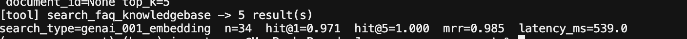
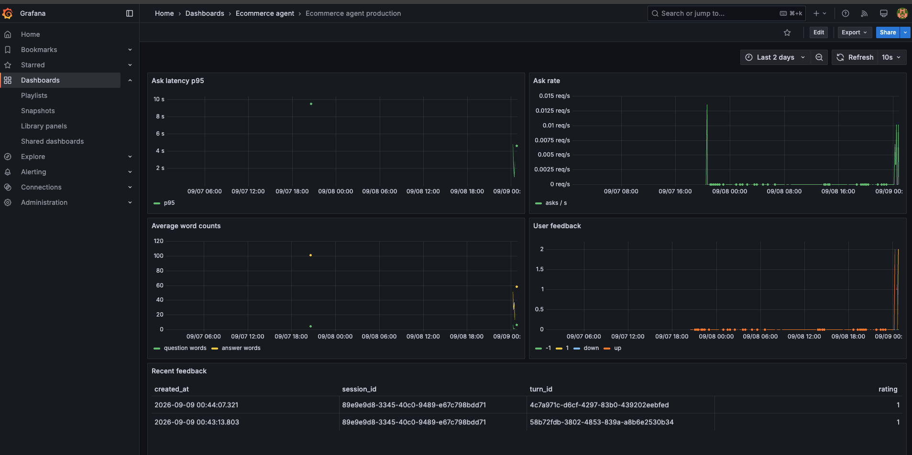

# Evaluations

Offline scripts in `evals/`. They are **not** on the chat/ingest path and are **not** collected by `uv run pytest`. This repo does not start MLflow; evals log to `MLFLOW_TRACKING_URI` (default [http://127.0.0.1:5000](http://127.0.0.1:5000)).

From the host:

```bash
uv run python evals/evaluate_llm_response.py \
  --provider mistral --experiment ecommerce-agent-llm_eval
```

From the app container, set `MLFLOW_TRACKING_URI` to a URL that container can reach:

```bash
docker compose run --rm app uv run --frozen --no-dev python evals/evaluate_llm_response.py \
  --provider mistral --experiment ecommerce-agent-llm_eval
```

`--experiment` is required on MLflow evals. If that name already exists, the new run is added to it; otherwise MLflow creates the experiment. Name experiments `ecommerce-agent-{kind}` (`llm_eval`, `search_eval`). Reuse the same name to compare runs; a new name starts a separate experiment.

Each run is named from the system under test: LLM runs are `llm-eval-{provider}-{model}` (read from the built agent). Search runs are `search-eval-{search_type}-{embedding_model}` (`search_type` from the flag; `embedding_model` from the `Settings` dataclass in `config.py`).

## What lives here

| Piece | Role |
|---|---|
| `datasets/faq_ground_truth.json` | Gold FAQ chunks (id + `## question` / answer content) pulled from the knowledge base |
| `generate_eval_data.py` | Asks OpenAI for two shopper-style paraphrases per FAQ |
| `datasets/retrieval_eval_dataset.json` | Synthetic question + gold chunk, for search hit-rate |
| `datasets/llm_eval_dataset.json` | MLflow `inputs` / `expectations` rows, for answer correctness |
| `evaluate_knowledge_search.py` | Retrieval metrics in the terminal (hit@1, hit@k, MRR) |
| `evaluate_knowledge_search_mlflow.py` | Same retrieval metrics, logged to MLflow |
| `evaluate_llm_response.py` | Runs `build_agent()` on each synthetic question; MLflow Correctness grades the answer |

Flow: gold FAQ → synthetic questions → (1) did search retrieve the right chunk? (2) did the **agent** (tools + instructions) answer match the gold answer?

## Generate datasets

Needs `OPENAI_API_KEY`. Writes both eval JSON files:

```bash
uv run python evals/generate_eval_data.py
```

## Search eval

Needs Postgres with the FAQ Google Doc already ingested (structured ingest so each `h2` is one chunk). `search_faq_knowledgebase` is the same tool the agent uses.

`--search-type` is required (a label for the embedding/retrieval setup, e.g. `genai_001_embedding`). Omit it and the script exits.

Terminal only:

```bash
uv run python evals/evaluate_knowledge_search.py --search-type genai_001_embedding
```

Same as `make evaluate_retrieval SEARCH_TYPE=genai_001_embedding`.

Log to MLflow. `--experiment` is required. The run records param `search_type`, retrieval metrics, and mean `latency_ms`:

```bash
uv run python evals/evaluate_knowledge_search_mlflow.py --search-type genai_001_embedding --experiment ecommerce-agent-search_eval
```

Useful flags:

```bash
uv run python evals/evaluate_knowledge_search.py --search-type genai_001_embedding --top-k 5
uv run python evals/evaluate_knowledge_search.py --search-type genai_001_embedding --document-id 1FlKHKxwltF_2S9ADmkfT3B0ajapSMrVKYWRUXf13mno
```

Pass `--document-id` when more than one knowledge-base document exists. A **hit** means the gold `content` appears in the top-k retrieved chunks (whitespace-normalized). **MRR** is the mean reciprocal rank of that chunk.



## Agent response eval

Needs Postgres with FAQ chunks ingested, the provider API key, and MLflow. Each row calls `build_agent()` (same tools and instructions as `POST /ask`). Rows run one at a time (`MLFLOW_GENAI_EVAL_MAX_WORKERS=1`) with a 1 second pause after each prediction so provider rate limits are not hit. `--provider` and `--experiment` are required (`openai`, `mistral`, `openrouter`, or `ollama`). The chat model is the provider default in `_core/config.py`; after the agent is built, `provider` and `model` are read from that object and logged as MLflow params. Mean `latency_ms` and token totals (`input_tokens`, `output_tokens`, `total_tokens`) are logged as metrics. MLflow's Correctness judge also uses an LLM (typically OpenAI).

```bash
uv run python evals/evaluate_llm_response.py --provider mistral --experiment ecommerce-agent-llm_eval
```

Same as `make evaluate_llms PROVIDER=mistral EXPERIMENT=ecommerce-agent-llm_eval`. Optional `--n` evaluates only the first n rows (also `make evaluate_llms ... N=3`):

```bash
uv run python evals/evaluate_llm_response.py --provider mistral --experiment ecommerce-agent-llm_eval --n 3
```

Other backends:

```bash
uv run python evals/evaluate_llm_response.py --provider openai --experiment ecommerce-agent-llm_eval
uv run python evals/evaluate_llm_response.py --provider openrouter --experiment ecommerce-agent-llm_eval
uv run python evals/evaluate_llm_response.py --provider ollama --experiment ecommerce-agent-llm_eval
```

Reuse `--experiment ecommerce-agent-llm_eval` to append runs to that experiment.


## Production monitoring

This stack exposes Prometheus text on [http://localhost:8000/metrics](http://localhost:8000/metrics) (`ask_latency_seconds`, ask rate, word counts, thumbs `rating` 1 / -1). Scrape that endpoint from your own Prometheus; Grafana dashboards live in that observability stack, not in this repo. Local `/ask` and `/feedback` do not require Prometheus or Grafana to be running.



## Traces

Langfuse records `POST /ask` tool calls and generations (OpenInference). Sessions group by `session_id`. This is live observability, not the MLflow eval experiments above.


